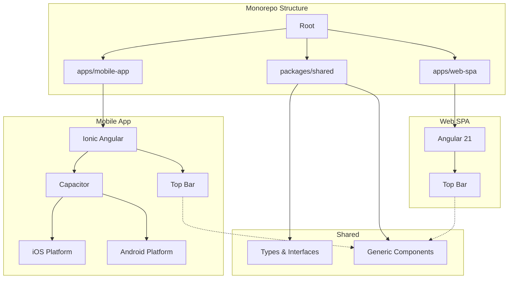

# Monorepo Starter Template

A **monorepo** containing an **Angular 21 SPA** and **Ionic Angular Capacitor** hybrid mobile app (iOS/Android) with Docker containerization for development.

This project serves as a robust starting point for building cross-platform applications with a shared codebase.

## 📋 Table of Contents

- [Project Overview](#project-overview)
- [Architecture](#architecture)
- [Prerequisites](#prerequisites)
- [Quick Start with Docker](#quick-start-with-docker)
- [Local Development](#local-development)
- [Project Structure](#project-structure)
- [Troubleshooting](#troubleshooting)

## 🎯 Project Overview

This monorepo provides a complete starter template including:

- **Angular 21 SPA** (`apps/web-spa`) - Standalone components, modern Angular features
- **Ionic Angular Mobile App** (`apps/mobile-app`) - Capacitor-powered hybrid app for iOS and Android
- **Shared Library** (`packages/shared`) - Common types, interfaces, and components
- **Docker Setup** - Containerized development environment with hot-reload

## 🏗️ Architecture



## ✅ Prerequisites

### Required

- **Node.js** 18.x or 20.x ([Download](https://nodejs.org/))
- **Docker Desktop** ([Download](https://www.docker.com/products/docker-desktop/))
- **Git** ([Download](https://git-scm.com/))

### 📖 Guides
- [**Debugging & Emulator Guide**](./DEBUGGING_GUIDE.md) - **Read this for running on simulators!**
- [Quick Start](./QUICKSTART.md)

### For native builds

- **Xcode** (macOS only, for iOS development)
- **Android Studio** (for Android development)
- **CocoaPods** (macOS only, for iOS dependencies): `sudo gem install cocoapods`

## 🚀 Quick Start with Docker

The fastest way to get started is using Docker:

### 1. Clone and Navigate

```bash
cd /path/to/repo
```

### 2. Build and Start Containers

```bash
# Build the Docker images
docker-compose build

# Start both web and mobile dev servers
docker-compose up
```

### 3. Access Applications

- **Web SPA**: http://localhost:4200
- **Mobile App**: http://localhost:8100

### 4. Stop Containers

```bash
# Stop services
docker-compose down

# Stop and remove volumes (clean slate)
docker-compose down -v
```

## 💻 Local Development

If you prefer to run locally without Docker:

### 1. Install Dependencies

Install dependencies for all three projects using `--legacy-peer-deps` (required for Angular 21 compatibility):

```bash
# Install shared library dependencies
cd packages/shared
npm install --legacy-peer-deps

# Install Web SPA dependencies
cd ../../apps/web-spa
npm install --legacy-peer-deps

# Install Mobile App dependencies
cd ../mobile-app
npm install --legacy-peer-deps
```

### 2. Run Web SPA

```bash
cd apps/web-spa
npm start
# Access at http://localhost:4200
```

### 3. Run Mobile App

```bash
cd apps/mobile-app
npm start
# Access at http://localhost:8100
```

### 3. Build for Native Platforms

#### iOS (macOS only)

**Prerequisite**: You must install dependencies locally first.

```bash
cd apps/mobile-app
npm install --legacy-peer-deps
npm run build
npx cap sync ios
npx cap open ios
# Opens Xcode - build and run from there
```

#### Android

**Prerequisite**: You must install dependencies locally first.

```bash
cd apps/mobile-app
npm install --legacy-peer-deps
npm run build
npx cap sync android
npx cap open android
# Opens Android Studio - build and run from there
```

## 📁 Project Structure

```
hackathon/
├── apps/
│   ├── web-spa/                    # Angular 21 SPA
│   │   ├── src/
│   │   │   ├── app/
│   │   │   │   ├── app.ts
│   │   │   │   └── app.routes.ts
│   │   │   └── main.ts
│   │   └── package.json
│   │
│   └── mobile-app/                 # Ionic Angular Capacitor App
│       ├── src/
│       │   ├── app/
│       │   │   ├── tab1/           # Home Tab
│       │   │   └── app.component.ts
│       │   └── main.ts
│       ├── ios/                    # iOS platform (Capacitor)
│       ├── android/                # Android platform (Capacitor)
│       ├── capacitor.config.ts
│       └── package.json
│
├── packages/
│   └── shared/                     # Shared library
│       ├── src/
│       │   ├── lib/
│       │   │   ├── types.ts        # Common interfaces
│       │   │   └── components/     # Shared components
│       │   └── public-api.ts
│       └── package.json
│
├── Dockerfile                      # Development Docker image
├── docker-compose.yml              # Docker services
├── .dockerignore
├── .gitignore
└── README.md
```

## 📦 Shared Library Architecture

The `packages/shared` directory contains code reused across both Web and Mobile apps. This ensures consistency and reduces duplication.

### Structure

```
packages/shared/
├── src/
│   ├── lib/
│   │   ├── components/     # Shared UI components (e.g., TopBar)
│   │   └── types.ts        # Shared interfaces and types
│   └── public-api.ts       # Main entry point - EXPORTS EVERYTHING HERE
```

### How to Use

**1. Create your component/service/type** in `packages/shared/src/lib/...`

**2. Export it in `packages/shared/src/public-api.ts`**:
```typescript
export * from './lib/components/my-new-component/my-new-component';
```

**3. Import it in your apps using the alias**:
```typescript
// ✅ CORRECT: Uses the alias defined in tsconfig
import { MyNewComponent } from '@hackathon/shared';

// ❌ INCORRECT: Fragile relative path
import { MyNewComponent } from '../../../../packages/shared/src/lib/...';
```

### Adding New Dependencies

If you need to add a package to the shared library:
1. `cd packages/shared`
2. `npm install --legacy-peer-deps <package-name>`
3. If it's a peer dependency (like Angular), add it to `peerDependencies` in `package.json` as well.

**Note**: Always use `--legacy-peer-deps` flag when installing packages due to Angular 21 compatibility requirements.

## 🔧 Troubleshooting

### Docker Issues

**Problem**: Containers won't start
```bash
# Clean everything and rebuild
docker-compose down -v
docker system prune -a
docker-compose build --no-cache
docker-compose up
```

**Problem**: Hot reload not working
- Ensure volumes are properly mounted in `docker-compose.yml`
- Try adding `--poll 2000` flag to dev server commands

### Mobile Platform Issues

**Problem**: iOS build fails
```bash
cd apps/mobile-app/ios/App
pod install
```

**Problem**: Android build fails
- Open Android Studio
- File > Invalidate Caches / Restart
- Sync Gradle files

## 📚 Resources

- [Angular Documentation](https://angular.dev)
- [Ionic Framework Docs](https://ionicframework.com/docs)
- [Capacitor Documentation](https://capacitorjs.com/docs)

## 📝 License

This project is provided as a starter template.

---

**Happy Coding! 🚀**
